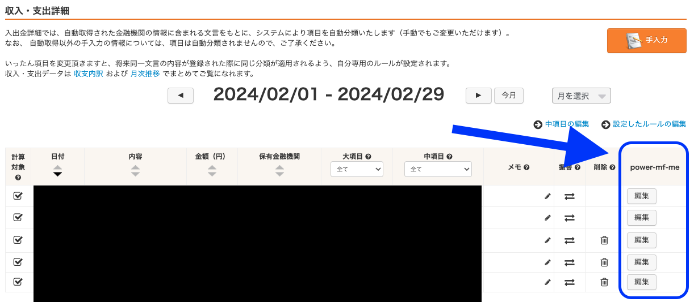

# power-mf-me

Money Forward ME を拡張するユーザースクリプト

## 使い方

### iOS/Mac Safari

1. safari 拡張機能 [Userscripts](https://apps.apple.com/jp/app/userscripts/id1463298887) をインストール
2. [最新の power-mf-me.user.js](https://github.com/cormoran/power-mf-me/releases/latest/download/power-mf-me.user.js) をダウンロードして Userscripts の設定したディレクトリに保存
3. https://moneyforward.me にログインして口座タブを開く
4. https://moneyforward.me の家計簿タブを開いて、変更したい項目の power-mf-me 列にある "編集" ボタンをクリック

### Chrome

1. chrome 拡張機能 [Tampermonkey](https://chromewebstore.google.com/detail/tampermonkey/dhdgffkkebhmkfjojejmpbldmpobfkfo) をインストール
2. [最新の power-mf-me.user.js](https://github.com/cormoran/power-mf-me/releases/latest/download/power-mf-me.user.js) にアクセスして、Tampermonkey に追加
3. https://moneyforward.me にログインして口座タブを開く
4. https://moneyforward.me の家計簿タブを開いて、変更したい項目の power-mf-me 列にある "編集" ボタンをクリック

## 機能

家計簿タブのテーブルに編集ボタンが追加される

編集ボタンを押すと開くモーダルから以下の機能が使える

### 日付の変更

- インポートしたデータの日付を変える
- 飛行機の費用を実際に旅行した日に変更する時などに使う

https://github.com/cormoran/power-mf-me/assets/7994064/34c96a35-7d3a-48ec-9460-2f77db03a05b

### 支出を分割

- 減価償却みたいなやつ
- 家具や旅行など大きな支出を数ヶ月にわたって分割で払ったことにする時に使う
- 残債みたいなものは "調整のための財布" に資産として計上されるので、総資産を見るときはグループ機能で "調整のための財布" 除外してみる必要がある

https://github.com/cormoran/power-mf-me/assets/7994064/08ba02c8-ef56-463f-a58a-9450ff9aa87b

### 自己負担額の登録

- インポートしたデータを自己負担分と立て替え分に分ける
- 食事などで全員分を立替払いした時などに、自分の分だけを支出として記録するために使う

https://github.com/cormoran/power-mf-me/assets/7994064/4df19b28-93e9-4999-ba1a-acb4897c88f7

### 仕組み

全ての機能は以下のように動作します

1. モーダルから設定する "調整のための財布" に指定した項目を振替登録する

- 支出項目の場合、"調整のための財布" に支出金額が計算対象外の収入として記録される
- クレジットカードなどに紐づいた元の支出項目は振替として計算対象から外れる

2. "調整のための財布" に適切な収入/支出を登録する

間違って操作した内容を消したい場合は以下の２つの操作を行なってください

1. クレジットカードなどに紐づいた元の項目の振替設定を解除する
2. "調整のための財布" に登録された関連項目を全て削除する
